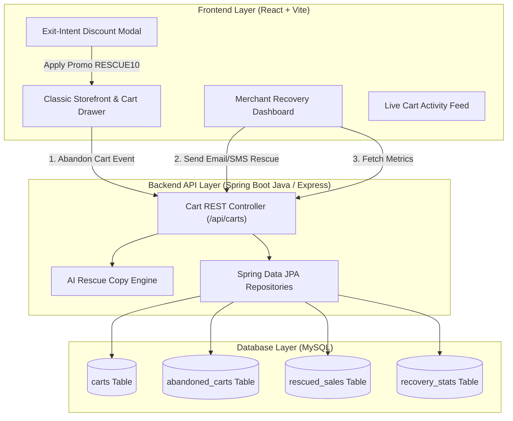
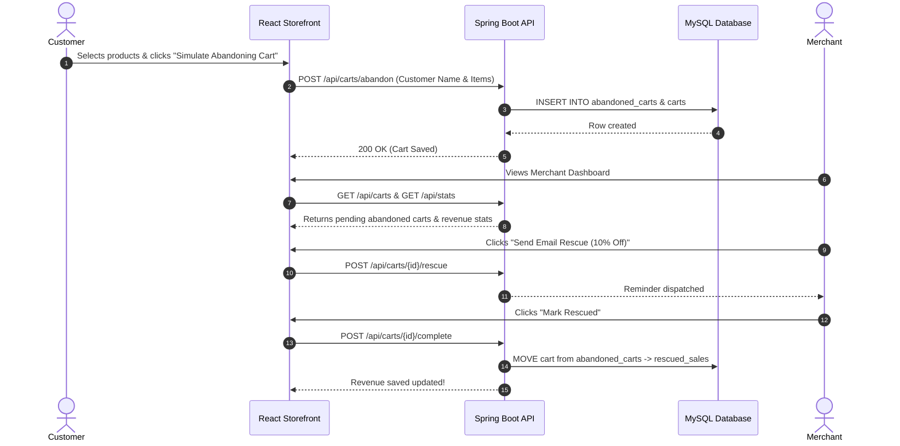
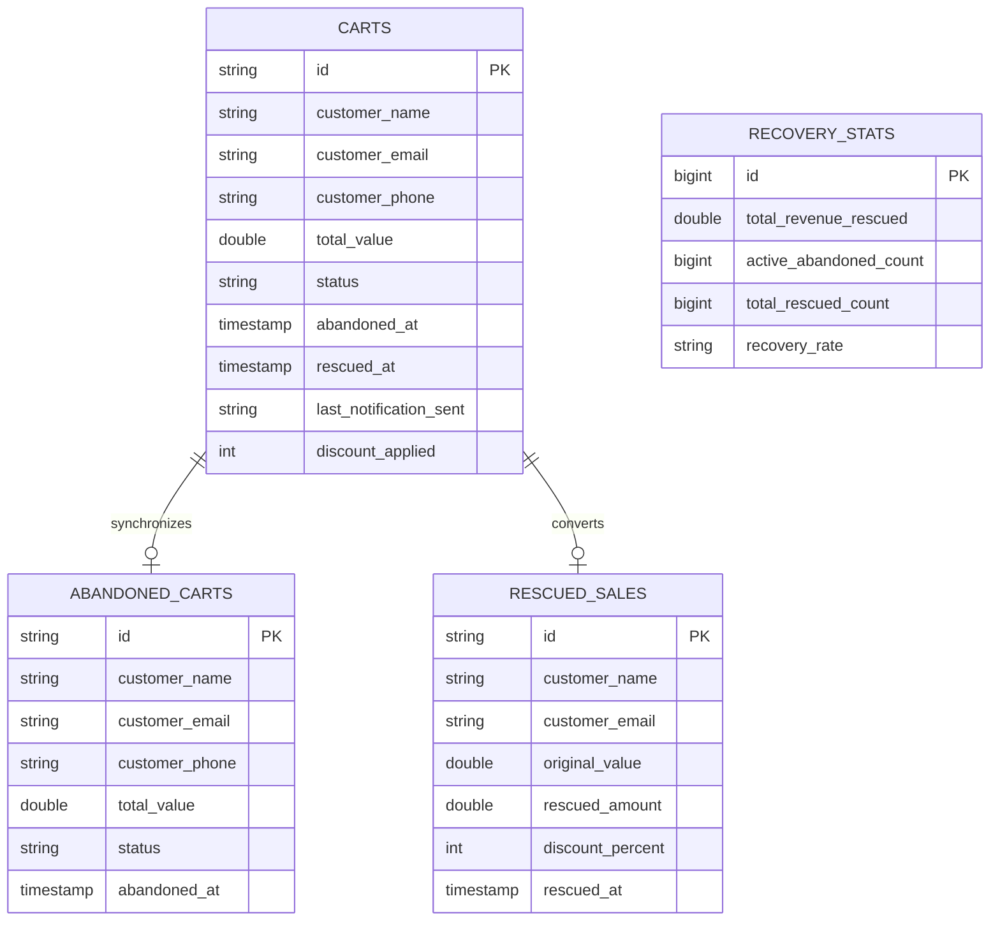

# 🛒 Cart Rescue - Abandoned Cart Recovery System

An e-commerce Abandoned Cart Recovery system featuring a classic visual design, clear simple English text, React + Vite frontend, Spring Boot Java REST backend, and MySQL database integration.

---

## 📌 Project Overview
**Cart Rescue** helps online merchants automatically track abandoned shopping carts, recover lost revenue with 1-click personalized discount reminders (Email/SMS/WhatsApp), and monitor recovery conversion metrics in real-time.

---

## 📐 System Architecture Diagram



---

## 🔄 Cart Recovery Sequence Workflow



---

## 🗄️ Database Entity Relationship (ER) Diagram



---

## ✨ Features
1. **Classic E-Commerce Storefront**: Product catalog with editable Customer Name, Email, and Phone fields + Quick Name Preset buttons (`Robert Fox`, `Emily Clark`, `Michael Scott`, `Alex Morgan`).
2. **Merchant Recovery Dashboard**: Real-time cards for Total Sales Rescued ($), Active Abandoned Carts (#), and Recovery Rate (%).
3. **1-Click Rescue Dispatch**: Send instant Email or SMS reminders with custom discount incentives.
4. **AI Simple English Recovery Copy Generator**: Built-in generator for warm, persuasive recovery messaging.
5. **Live Cart Activity Stream**: Filterable list of all active abandoned and rescued carts.
6. **Exit-Intent Discount Overlay**: Pop-up offering promo code `RESCUE10` before customers leave.

---

## 🛠️ Tech Stack
- **Frontend**: React 18, Vite, Lucide Icons, Canvas Confetti, Custom Vanilla CSS
- **Backend**: Spring Boot 3.2 (Java 17), Maven, Express.js (Node.js alternative)
- **Database**: MySQL 8.0, Spring Data JPA / Hibernate, H2 Database (Fallback)

---

## 🚀 How to Run the Project

### 1. Frontend Setup (VS Code)
```bash
cd cart-rescue-classic
npm install
npm run dev
```
Open browser at: **`http://localhost:5176`**

### 2. Backend Setup (Eclipse IDE)
1. Import `springboot-server` as **Existing Maven Project** in Eclipse.
2. Run [`CartRescueApplication.java`](file:///C:/Users/srini/.gemini/antigravity/scratch/cart-rescue-classic/springboot-server/src/main/java/com/cartrescue/CartRescueApplication.java) as **Spring Boot App**.
3. Backend runs on: **`http://localhost:8090`**

### 3. MySQL Database Configuration
Configuration file: `springboot-server/src/main/resources/application.properties`
```properties
spring.datasource.url=jdbc:mysql://localhost:3306/cart_rescue_db?createDatabaseIfNotExist=true
spring.datasource.username=root
spring.datasource.password=2300031783
```

---

## 📄 License
Distributed under the MIT License.
